Analysis part 1
================
Krzysztof Janik
02/11/2020

This is the analysis of my trading strategy. The analysis consists of 3
main parts: 1. Checking whether it’s possible to cut down on simulation
time. 2. Choosing the best set of trading parameters. 3. For the best
performing strategy, choose the best stocks via linear regression.

Firstly, I load the libraries: DBI for database connection, xts for
working with timeseries data, ggplot2 for plots. I also specify my
connection parameters here. The seed is set so that the random elements
can be reproduced.

    knitr::opts_chunk$set(fig.path='Figs/')

    library(DBI)
    library(xts)
    library(ggplot2)
    library(ggpubr)
    set.seed(1)
    db <- "lse_db"
    db_user <- 'krzysztofjanik' 
    db_password <- '####'
    db_port <- '5432'
    default_connection <- dbConnect(RPostgres::Postgres(), dbname = db, port=db_port, user=db_user, password=db_password)

One more thing before the actual analysis is to check the time period
for which the data is available.

    query <- "SELECT min(date) FROM prices"
    sent <- dbSendQuery(default_connection, query)
    minim <- dbFetch(sent)
    dbClearResult(sent)
    query <- "SELECT max(date) FROM prices"
    sent <- dbSendQuery(default_connection, query)
    maxim <- dbFetch(sent)
    dbClearResult(sent)
    cat("Start date: ", as.character(minim[1,]), ". End date: ", as.character(maxim[1,]), ".", sep = "")

    ## Start date: 2016-01-04. End date: 2020-09-29.

So we have nearly 5 years worth of data. I will divide it into train and
test dataset. Train will be years 2016,17 and 18. 2019 and 2020 will be
our test data.

    train_start_date <- "2016-01-04"
    train_end_date <- "2018-12-31"
    test_start_date <- "2019-01-01"
    test_end_date <- "2020-09-29"

Lastly, I use function I defined in trading\_algorithm.R to help with
the backtest. Note: the path is hardcoded, if you want to rerun this
file, modify it.

    source("/Users/krzysztofjanik/trading_project/trading_algorithm.R")

Part 1. Cutting down on the simulation time. Now, the full backtest of
strategy works through \~2000 stocks and takes 15 minutes. I will try to
see whether I can save some time, simulate only a couple hundred stocks
and still get similar performance measure. Firstly I have to desribe my
strategy. The following will measure my performance: mean of
returns,variation of returns,total return,sharpe ratio,equity curve, max
drawdown,max drawdown duration. Since I evaluate a strategy with a
stoploss as well as without one (as a worst-case-scenario), I evaluate
each measure twice.

    max_drawdowns <- function(accumulation){
      data <- data.frame(accumulated = accumulation)
      data$high_water <- NA
      for (i in seq(from = 1, to = nrow(data))){
        data$high_water[i] <- max(data$accumulated[1:i])
      }
      data$drawdown <- 100*((data$accumulated - data$high_water) / data$high_water)
      data$drawdown_duration <- NA
      for (i in seq(from = 1, to = nrow(data))){
        if (data$drawdown[i] < 0){
          data$drawdown_duration[i] <- data$drawdown_duration[i -1] + 1
        }
        else{
          data$drawdown_duration[i] <- 0
        }
      }
      max_drawdown <- min(data$drawdown)
      max_drawdown_duration <- max(data$drawdown_duration)
      to_give <- list(max_drawdown, max_drawdown_duration)
      return(to_give)
    }
    create_report <- function(strategy){
      report <- list()
      report$mean_return <- mean(strategy$return)
      report$mean_sreturn <- mean(strategy$return_stoploss)
      report$var_return <- var(strategy$return)
      report$var_sreturn <- var(strategy$return_stoploss)
      report$total_return <- tail(strategy$accumulated, n = 1)
      report$total_sreturn <- tail(strategy$accumulated_stoploss, n = 1)
      report$sharpe <- mean(strategy$return) / sd(strategy$return)
      report$ssharpe <- mean(strategy$return_stoploss) / sd(strategy$return_stoploss)
      report$equity <- strategy$accumulated
      report$sequity <- strategy$accumulated_stoploss
      drawdowns <- max_drawdowns(strategy$accumulated)
      report$max_drawdown <- drawdowns[[1]]
      report$max_drawdown_duration <- drawdowns[[2]]
      sdrawdowns <- max_drawdowns(strategy$accumulated_stoploss)
      report$smax_drawdown <- sdrawdowns[[1]]
      report$smax_drawdown_duration <- sdrawdowns[[2]]
      report$dates <- strategy$date
      return(report)
    }

I will now create a vectors o numbers, which will be the number of
stocks in the simulation. For each N I will create a report and see
whether performance measurments converge to the true number. First
though, I run the full simulation to obtain the the true numbers.

    if(file.exists("part1_data.RData")){
      load("part1_data.RData")
    } else {
      true_strategy <- strategy_summary(train_start_date, train_end_date, long_window = 50, short_window = 10, top_cutoff = 10, bottom_cutoff = -10, full = TRUE, connection = default_connection, stoploss = -2)
      
      true_report <- create_report(true_strategy[[1]])
      
      how_many_tidms <- c(seq(from = 5, to = 200, by = 5), seq(from = 220, to = 700, by = 20), seq(from =750, to = 1000, by = 50))
      
      report_dataframe <- data.frame(N = how_many_tidms, mean_return = NA,
                                   mean_sreturn = NA, var_return = NA, var_sreturn = NA,
                                   total_return = NA, total_sreturn = NA, sharpe = NA, 
                                   ssharpe = NA, max_drawdown = NA,
                                   max_drawdown_duration = NA, smax_drawdown = NA,
                                   smax_drawdown_duration = NA)
    equity <- list()
    sequity <- list()
    dates <- list()
    for (how_many in how_many_tidms){
      sample_strategy <- strategy_summary(start_date = "2016-01-01",
                                          end_date = "2018-12-31", 
                                          long_window = 50, short_window = 10, 
                                          top_cutoff = 10,
                                          bottom_cutoff = -10, tidms_size = how_many,
                                          connection = default_connection,
                                          stoploss = -2)
      sample_report <- create_report(sample_strategy[[1]])
      for (statistic in names(sample_report[c(-9,-10, -15)])){
        report_dataframe[report_dataframe$N == how_many, statistic] <- sample_report[[statistic]]
      }
      equity[[length(equity) + 1]] <- sample_report$equity
      sequity[[length(sequity) + 1]] <- sample_report$sequity
      dates[[length(dates) + 1]] <- sample_report$dates
    }
    save(dates,equity,sequity,report_dataframe,true_report, file = "part1_data.RData")
    }

I have performance indicators for some Ns from 5 to 1000, along with
equity curves. The easiest way to see whether my values are converging
is by graphical means. First, let’s look at the value of £1 invested on
the 4th of January 2016, in our full strategy.

    ggplot() + geom_line(mapping = aes(x = true_report$dates, y = true_report$sequity, colour = "#4285F4")) + geom_line(mapping = aes(x = true_report$dates, y = true_report$equity, colour = "#0F9D58")) + xlab("Date") + 
    ylab("Value of £1 investment") + ggtitle("Equity curve") + theme(plot.title = element_text(hjust = 0.5)) + scale_x_date(date_breaks = "3 months", date_labels = "%b %y") + ylim(0,200) + geom_abline(slope = 0, intercept = 1, linetype = 3) + scale_color_identity(guide = "legend", labels = c("Without stoploss", "Stoploss of -2%"), name = "") + scale_y_continuous(breaks=seq(0,200,10))

    ## Scale for 'y' is already present. Adding another scale for 'y', which
    ## will replace the existing scale.

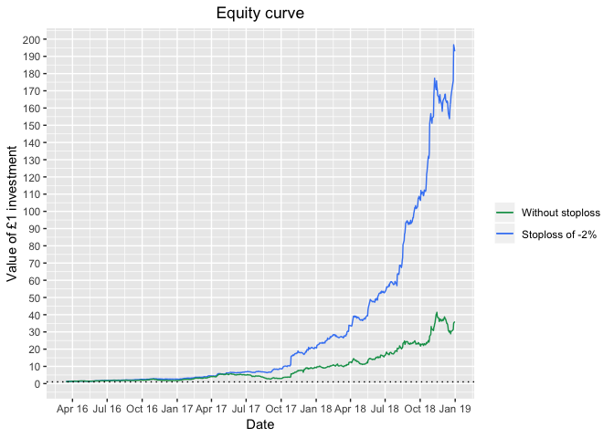<!-- --> As we can see, adding a stoploss
hugely improves performance, particularly later on in the strategy.

    #need to use aes_string
    p <- ggplot()
    for (n in seq(from = 1, to = length(dates), by = 1)){
      p <- p + geom_line(mapping = aes_string(x = dates[[n]], y = sequity[[n]]), alpha = n/71, col = "#4285F4", size = 0.2)
    }
    p <- p + geom_line(mapping = aes(x = true_report$dates, y = true_report$sequity), alpha = 1, col = "#4285F4", size = 1) + ggtitle("Stoploss of -2%") + xlab("Date") + ylab("Value of £1 investment") + theme(plot.title = element_text(hjust = 0.5)) + scale_x_date(date_breaks = "3 months", date_labels = "%b %y") + ylim(0,700) + geom_abline(slope = 0, intercept = 1, linetype = 3) + scale_y_continuous(breaks=seq(0,700,50))

    ## Scale for 'y' is already present. Adding another scale for 'y', which
    ## will replace the existing scale.

    q <- ggplot()
    for (n in seq(from = 1, to = length(dates), by = 1)){
      q <- q + geom_line(mapping = aes_string(x = dates[[n]], y = equity[[n]]), alpha = n/71, col = "#0F9D58", size = 0.2)
    }
    q <- q + geom_line(mapping = aes(x = true_report$dates, y = true_report$equity), alpha = 1, col = "#0F9D58", size = 1) + ggtitle("Without stoploss") + xlab("Date") + ylab("Value of £1 investment") + theme(plot.title = element_text(hjust = 0.5)) + scale_x_date(date_breaks = "3 months", date_labels = "%b %y") + ylim(0,250) + geom_abline(slope = 0, intercept = 1, linetype = 3) + scale_y_continuous(breaks=seq(0,250,25))

    ## Scale for 'y' is already present. Adding another scale for 'y', which
    ## will replace the existing scale.

    q

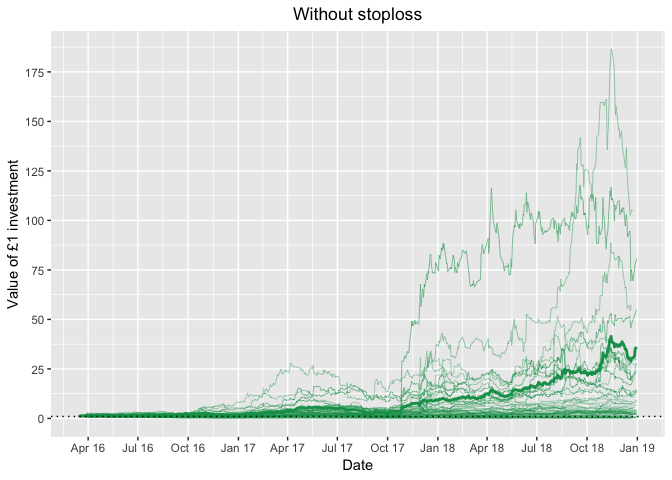<!-- -->

    p

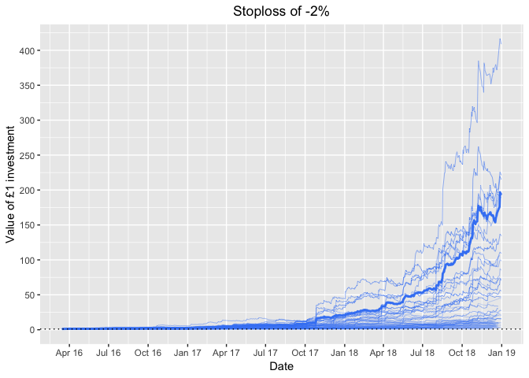<!-- --> In both graphs the thickets line
is the actual performance. What we can take aways from these are:
depending on how many n we choose, we get drastically different curves,
with different total returns bigger n isnt always the best option, there
combinations of stocks that offer outstanding performacne (finding these
is the subject of part 3 of my analysis) The last step of this part is
to compare how other different parameters change with N, again the
easiet way is to use graphical means.

    sec <- "#4285F4"
    ec <- "#0F9D58"
    mean_return <- ggplot() + geom_abline(slope = 0, intercept = true_report$mean_return, col = ec, linetype = 2) + geom_abline(slope = 0, intercept = true_report$mean_sreturn, col = sec, linetype = 2) + geom_point(mapping = aes(x = report_dataframe$N, y = report_dataframe$mean_return, col = ec)) + geom_point(mapping = aes(x = report_dataframe$N, y = report_dataframe$mean_sreturn, col = sec)) + ggtitle("") + xlab("N") + ylab("Mean return (%)") + theme(plot.title = element_text(hjust = 0.5)) + scale_y_continuous(breaks=seq(-1.5,3,0.2)) + scale_color_identity(guide = "legend", labels = c("Without stoploss", "Stoploss of -2%"), name = "") + scale_x_continuous(breaks=seq(0,1000,50))
    mean_return

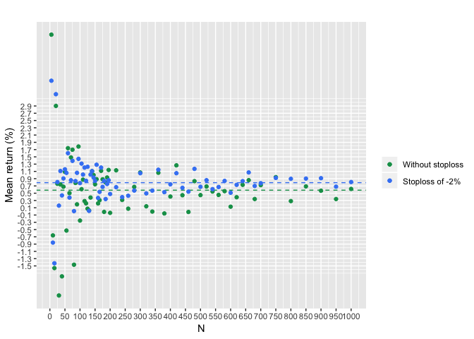<!-- -->

    ggplot() + geom_bar(aes(y = 100 * (abs(report_dataframe$mean_return - true_report$mean_return) / true_report$mean_return), x = report_dataframe$N), stat = "identity", fill = ec, position = "dodge")

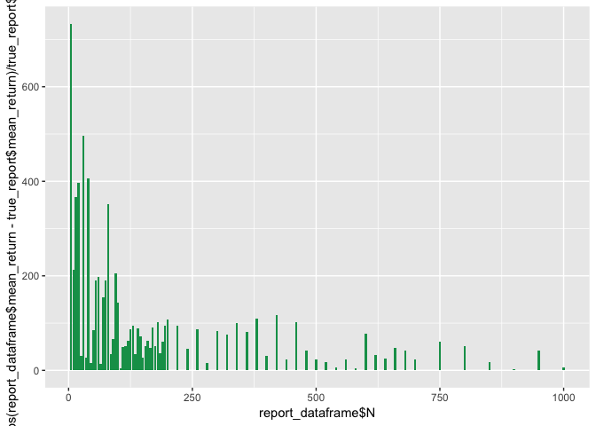<!-- -->

    ggplot() + geom_bar(aes(y = 100 * (abs(report_dataframe$mean_sreturn - true_report$mean_sreturn) / true_report$mean_sreturn), x = report_dataframe$N), stat = "identity", fill = sec, position = "dodge")

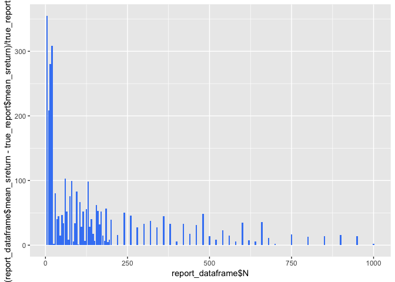<!-- -->

    df_barplot <- data.frame(N = c(report_dataframe$N, report_dataframe$N), diff = c(100* abs(report_dataframe$mean_return - true_report$mean_return)/ true_report$mean_return,100 * abs(report_dataframe$mean_sreturn - true_report$mean_sreturn)/ true_report$mean_sreturn), type = c(rep("e", 71), rep("se", 71)))

    bar <- ggplot() + geom_bar(aes(x = df_barplot$N, y = df_barplot$diff, fill = df_barplot$type), stat = "identity", position = "dodge") + ylab("Difference (%)") + xlab("N") + ggtitle("") + scale_y_continuous(breaks=seq(0,400,50)) + scale_x_continuous(breaks=seq(0,1000,50)) + theme(plot.title = element_text(hjust = 0.5)) + scale_fill_manual(values = c(ec, sec), guide = "legend", labels = c("Without stoploss", "Stoploss of -2%"), name = "")
    bar

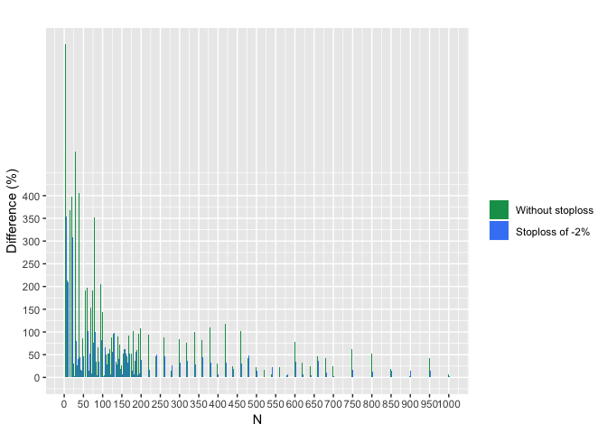<!-- -->

    mean_return

<!-- -->

    ggarrange(mean_return, bar, ncol = 2, nrow = 1, labels = c("Mean return", "% difference from true value"))

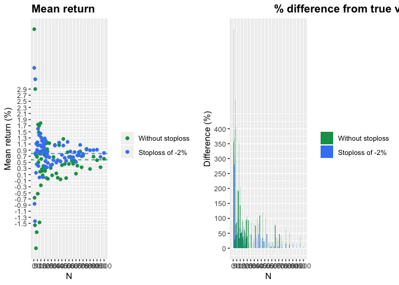<!-- -->

    create_point_plot <- function(e, se, te, tse, title, y_breaks, y_lab){
      point_plot <- ggplot() + geom_abline(slope = 0, intercept = te, col = ec, linetype = 2) + geom_abline(slope = 0, intercept = tse, col = sec, linetype = 2) + geom_point(mapping = aes(x = report_dataframe$N, y = e, col = ec)) + geom_point(mapping = aes(x = report_dataframe$N, y = se, col = sec)) + ggtitle(title) + xlab("N") + ylab(y_lab) + theme(plot.title = element_text(hjust = 0.5)) + scale_color_identity(guide = "legend", labels = c("Without stoploss", "Stoploss of -2%"), name = "") + scale_x_continuous(breaks=seq(0,1000,50))
      if (y_breaks != "skip"){
        point_plot <- point_plot + scale_y_continuous(breaks = y_breaks)
      } 
    return(point_plot) 
    }
    create_point_plot(report_dataframe$var_return, report_dataframe$var_sreturn, true_report$var_return, true_report$var_sreturn, "Variance of returns", seq(0,300,50), "Variance of returns")

    ## Warning in if (y_breaks != "skip") {: the condition has length > 1 and only
    ## the first element will be used

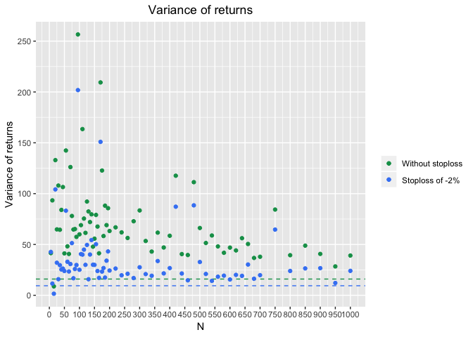<!-- -->

    create_point_plot(report_dataframe$total_return, report_dataframe$total_sreturn, true_report$total_return, true_report$total_sreturn, "Total return", seq(0,650,50), "Total return (x times)")

    ## Warning in if (y_breaks != "skip") {: the condition has length > 1 and only
    ## the first element will be used

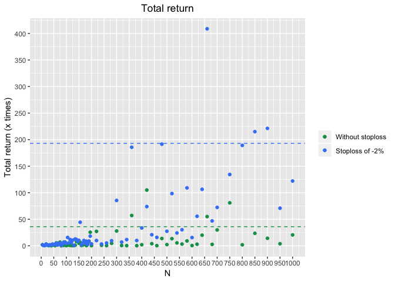<!-- -->

    create_point_plot(report_dataframe$sharpe, report_dataframe$ssharpe, true_report$sharpe, true_report$ssharpe, "Sharpe ratio", round(seq(-0.6,0.5,0.1),1), "Sharpe ratio")

    ## Warning in if (y_breaks != "skip") {: the condition has length > 1 and only
    ## the first element will be used

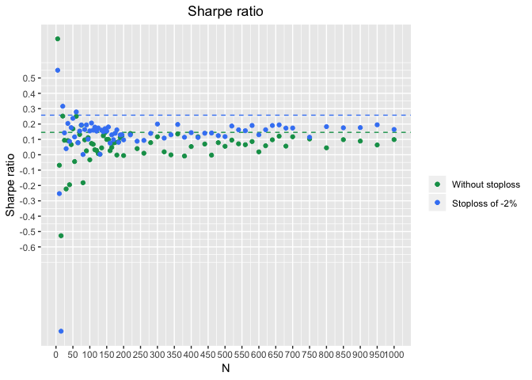<!-- -->

    create_point_plot(report_dataframe$max_drawdown, report_dataframe$smax_drawdown, true_report$max_drawdown, true_report$smax_drawdown, "Max drawdown", seq(-100,0,10), "Max drawdown (%)")

    ## Warning in if (y_breaks != "skip") {: the condition has length > 1 and only
    ## the first element will be used

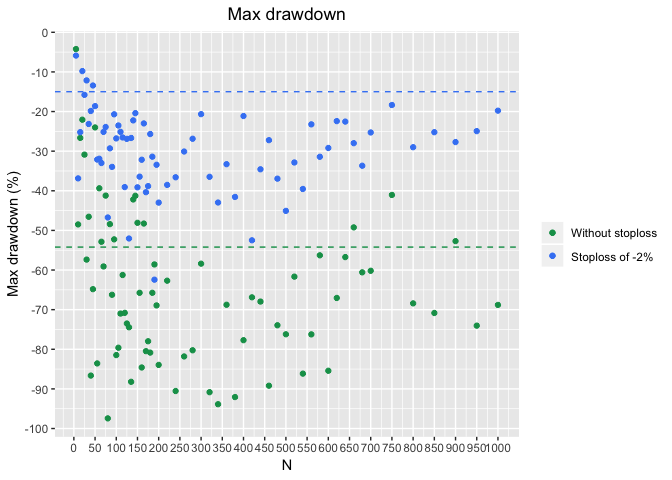<!-- -->

    create_point_plot(report_dataframe$max_drawdown_duration, report_dataframe$smax_drawdown_duration, true_report$max_drawdown_duration, true_report$smax_drawdown_duration, "Max drawdown duration", "skip", "Max drawdown duration (days)")

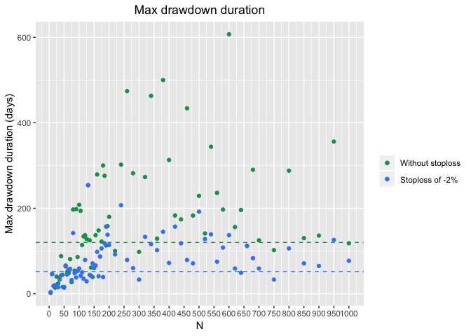<!-- -->

    ggarrange(mean_return, bar, ncol = 1, nrow = 2, labels = c("Mean return", "% difference from true value"))

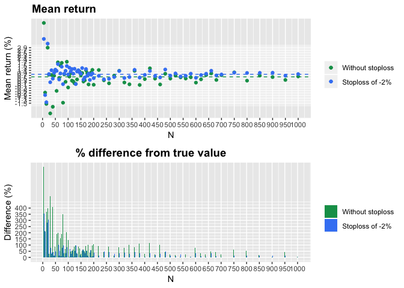<!-- -->

    ggarrange(mean_return, bar, ncol = 2, nrow = 1, labels = c("Mean return", "% difference from true value"))

<!-- -->

    save(dates,equity,sequity,report_dataframe,true_report, file = "part1_data.RData")
